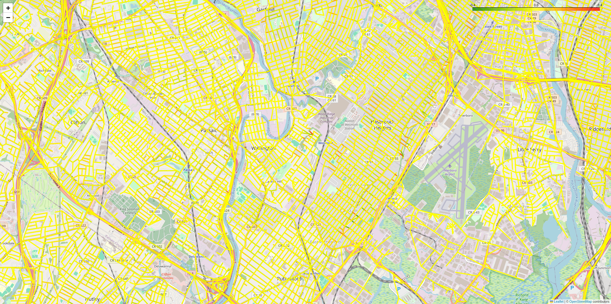

## preprocessing-for-routing

### Dataset
- speed limit: It can be downloaded from [1].
- elevation: It can be downloaded from [2].

### Description
`get_speed_limit.ipynb` and `get_elevation.ipynb` add speed limit (unit: m/s) and elevation (unit: radians) attributes to each road edge, respectively.

### Visualization
`visualization.ipynb` visualizes speed limits and elevations for each road link.
It is the result of visualizing the elevation of the New York area, and the most terrains are flat.

### Reference
[1] https://data.cityofnewyork.us/Transportation/VZV_Speed-Limits/7n5j-865y  
[2] https://developers.google.com/maps/documentation/elevation/requests-elevation